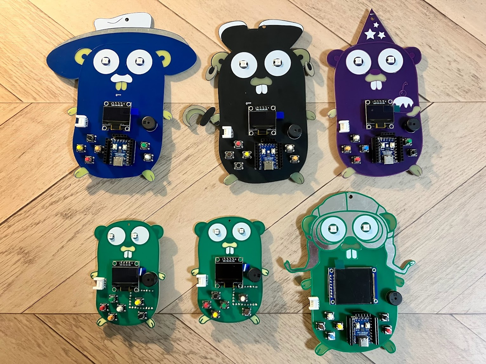

# gopher-board-workshop

[gopher-board](https://github.com/sat0ken/gopher-board) は Go のマスコットキャラクターの Gopher を型取ったオリジナル基板です。




様々なデザインの基板がありますが、構成は同じです。

## 環境設定

- TinyGo のインストール

以下より TinyGo をインストールしてください  
https://tinygo.org/getting-started/install/

## 基板について

基板には以下の部品がついています。

- マイコン
- スイッチ
- フルカラーLED
- 液晶
- ブザー
- Grove端子

## ワークショップ

- Lチカ

LEDを29とGNDに挿します。LEDの長い方を29に短い方をGNDにして向きを間違えないように挿してください。
LEDを挿したら以下のコマンドでプログラムを書き込みます。

```
$ tinygo flash --target waveshare-rp2040-zero --size short ./00_blink/main.go
```

- デジタル入力とシリアル通信

基板には6つのスイッチがついています。押されたスイッチを読み取るデジタル入力のプログラムを書き込みます。

```
$ tinygo flash --target waveshare-rp2040-zero --size short ./01_switch/main.go
```

`tinygo monitor`を実行して↑のボタンを押すとメッセージが出力されます。

```
$ tinygo monitor
Connected to /dev/ttyACM0. Press Ctrl-C to exit.
button up is pressed!!
button up is pressed!!
```

Goのprintln関数は標準出力にメッセージを出力しますが、TinyGoのprintln関数はシリアルに出力します。

- アナログ入力
- アナログ出力
- ブザーを鳴らす
- フルカラーLEDを光らす
- 液晶画面に文字を出す
- [koebiten](https://github.com/sago35/koebiten)でゲームを遊んでみる
