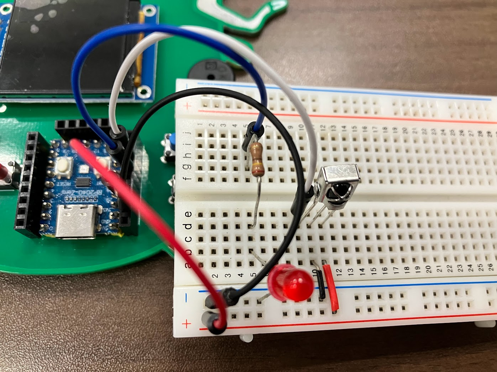

# gopher-board-workshop

[gopher-board](https://github.com/sat0ken/gopher-board) は Go のマスコットキャラクターの Gopher を型取ったオリジナル基板です。


様々なデザインの基板がありますが、構成は同じです。

## 環境設定

- TinyGo のインストール

以下より TinyGo をインストールしてください  
https://tinygo.org/getting-started/install/

## 基板について

基板には以下の部品がついています。

- マイコン
- スイッチ
- フルカラーLED
- 液晶
- ブザー
- Grove端子

## ワークショップ

### ブレットボード

まずワークショップで利用するブレットボードについて説明します。  
ブレットボードはパーツを差し込んで簡単に電子回路を作成して試すことができるものです。
外側の+-は縦方向に、A~EとF~Jは横方向に接続されています。

Gopherくん基板とブレットボードを接続します。  
3V3のPinに赤いジャンパー線を挿したら、ブレットボードの+に接続します。  
GNDのPinに黒いジャンパー線を挿したら、ブレットボードの-に接続します。

これで準備は完了です。

### Lチカ

LEDには向きがあります。足の短い方を-の列に挿して、長い方はaに挿します。  
抵抗をコの字に曲げて、LEDと同じ列に挿します。  
抵抗を挿したらジャンパー線を29に挿して、もう片方を抵抗と同じ列に挿します。


回路を作成したらプログラムを書き込みます。LEDが1秒おきに点滅します。

```
$ tinygo flash --target waveshare-rp2040-zero --size short ./00_blink/main.go
```

### 01. デジタル入力とシリアル通信

Gopherくん基板には6つのスイッチがついています。押されたスイッチを読み取るデジタル入力のプログラムを書き込みます。

```
$ tinygo flash --target waveshare-rp2040-zero --size short ./01_switch/main.go
```

`tinygo monitor`を実行してUpボタンを押すとメッセージが出力されます。

```
$ tinygo monitor
Connected to /dev/ttyACM0. Press Ctrl-C to exit.
button up is pressed!!
button up is pressed!!
```

Goのprintln関数は標準出力にメッセージを出力しますが、TinyGoのprintln関数はシリアルポートに出力します。

### 02. アナログ入力

光センサーを使いアナログ入力を試してみます。
スイッチによるデジタル入力は0か1になりますが、アナログ入力は0~1023, 0~65535など幅のある数値になります。

光センサーの片方を+に挿してもう片方はbの列に挿します。  
ジャンパー線を26と光センサーと同じ列に挿します。


```
$ tinygo flash --target waveshare-rp2040-zero --size short ./02_analog_input/main.go
```

プログラムを書き込んだら、`tinygo monitor`を実行します。
センサーを指で抑えてみると値が若干小さくなるのがわかります。

```
$ tinygo monitor
Connected to /dev/ttyACM0. Press Ctrl-C to exit.
+3.299245e+000
+3.299245e+000
+3.299245e+000
+3.282325e+000
+3.299245e+000
+3.285548e+000
+3.255738e+000
+3.288771e+000
+3.299245e+000
+3.279908e+000
+3.249293e+000
+3.269434e+000
+3.295216e+000
```

光センサーは明るさによって抵抗値が変化します。明るいときは抵抗値が小さく、暗くなると抵抗値が大きくなります。  
明るいときは3.3vに近い値が流れますが、暗くなると抵抗値が大きくなるので流れる電流が減少します。そのため指で抑えると値が小さくなります。

### 03. アナログ出力

PWM(Pulse Width Modulation: パルス幅変調)を利用したアナログ出力でLEDを光らせます。  
プログラムを書くとLチカの時とはLEDの光り方が異なり、ホタルのよう暗くなったり明るくなったりと光ります。

```
$ tinygo flash --target waveshare-rp2040-zero --size short ./03_pwm/main.go
```

PWMによるアナログ出力は、一定の周波数で高速でHIGHとLOWを切り替えることで供給する電力を制御します。  
供給される電力が高いときはLEDが明るく光り、電力が低いときはLEDが暗くなります。

https://tinygo.org/tour/pwm/fade/

### 04. フルカラーLED

Gopherくんの目の部分にはフルカラーLEDのWS2812がついています。これを光らせてみましょう。  
WS2812自体に小さなマイコンがついていてマイコンにRGBの信号を送ると光るようになっています。
TinyGoではWS2812用のドライバがあるのでそれを利用します。

```
$ tinygo flash --target waveshare-rp2040-zero --size short ./04_ws1812/main.go
```

### 05. ブザーを鳴らす


### 06. 温湿度センサー

BME280というセンサーで温湿度や気圧を取得してみます。
基板とブレットボードをジャンパー線で以下のように配線します。

VCC - 3v3
GND - GND
GP0 - SDA
GP1 - SCL


配線したらプログラムを書き込みます。

```
$ tinygo flash --target waveshare-rp2040-zero --size short ./06_bme280/main.go
```

プログラムを書き込んだら、`tinygo monitor`を実行します。
温度が取れていることがわかります。

```
$ tinygo monitor
Connected to /dev/ttyACM0. Press Ctrl-C to exit.
Temperature: 29.37 °C
Pressure: 1007.01 hPa
Humidity: 0.00 %
Altitude: 52 m
Temperature: 29.39 °C
Pressure: 1006.98 hPa
Humidity: 0.00 %
Altitude: 52 m
```

### 07. 赤外線リモコン

テレビやエアコンなど家電で利用される赤外線リモコンの挙動をTinyGoで体験してみましょう。
リモコンは送信と受信に分かれます。

送信側の回路はLEDを赤外線LEDに取り替えます。


送信側のプログラムを書き込みます。

```
$ tinygo flash --target waveshare-rp2040-zero --size short ./07_ir_recieve/main.go
```

受信側の回路は赤外線受信モジュールをLEDの横に取り付けます。




受信側のプログラムを書き込みます。

```
$ tinygo flash --target waveshare-rp2040-zero --size short ./07_ir_send/main.go
```

送信側はUpボタンを押すと赤外線LEDが光り、データを送信します。
受信側はデータを受信したらLEDが光ります。

赤外線リモコンは赤外線LEDをPWMで38khzに点滅するように制御することで成り立ちます。  
赤外線リモコンは、ボタンが押されると、そのボタンに対応した特定のパターンの赤外線信号を送信します。機器の受信側は、その光のパターンを読み取り、命令を実行します。  
リモコンの信号は、この変調された赤外線の「ON（点滅している状態）」と「OFF（消えている状態）」の時間の長さの組み合わせで、「0」と「1」のデジタルデータを作り、情報を伝えています。


### 液晶画面に文字を出す

```
$ tinygo flash --target waveshare-rp2040-zero --size short ./08_st7789/main.go
```

### [koebiten](https://github.com/sago35/koebiten)でゲームを遊んでみる
