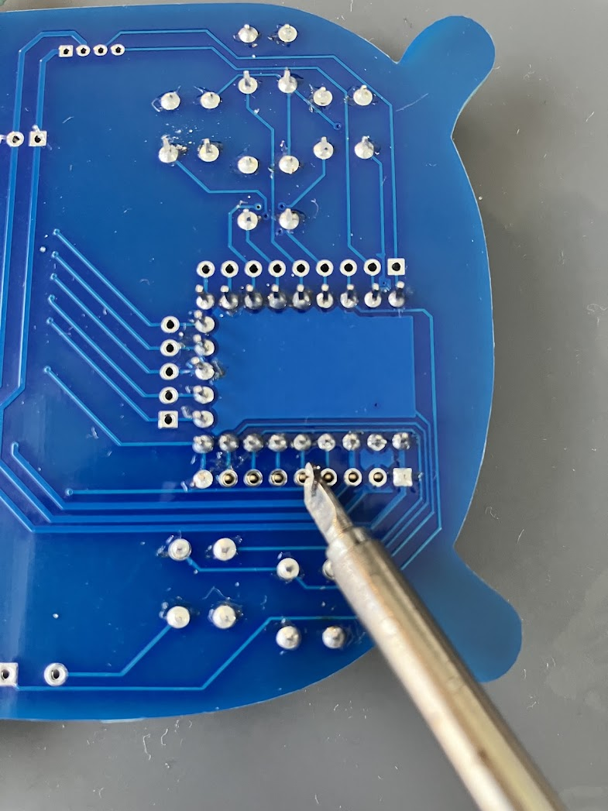
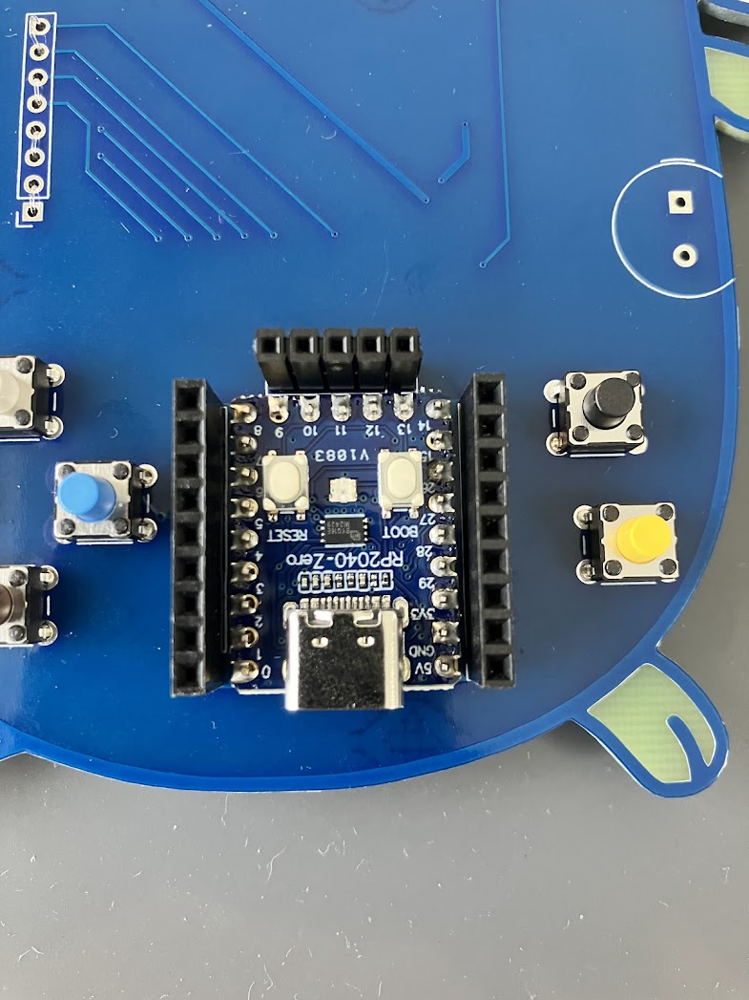

# Gopherくん基板ビルドガイド

## パーツリスト

- マイコン 1つ  
https://www.switch-science.com/products/7886
https://www.sengoku.co.jp/mod/sgk_cart/detail.php?code=EEHD-6633

	※aliexpress(安い)  
https://ja.aliexpress.com/item/1005004383458678.html

- 液晶 1つ  
https://akizukidenshi.com/catalog/g/g131019/

	※aliexpress(安い)  
https://ja.aliexpress.com/item/1005008349075553.html

- タクトスイッチ 1つ  
https://akizukidenshi.com/catalog/g/g101282/

- Groveコネクタ 1つ  
https://akizukidenshi.com/catalog/g/g112634/

- ブザー 1つ  
https://akizukidenshi.com/catalog/g/g104118/

- WS2812 2つ  
https://akizukidenshi.com/catalog/g/g107915/

- ピンソケット(9ピン) 2つ  
https://akizukidenshi.com/catalog/g/g110100/

- ピンソケット(5ピン) 1つ  
https://akizukidenshi.com/catalog/g/g102762/

- 330ΩSMD抵抗 2012_0805 1つ

## 組み立て

※目にLEDがついていない状態から始めるはんだ付け上級者はページ下部の上級者向け組み立てを先にやってください。

マイコンの袋を開けます。中に9ピンのピンヘッダーが2つ入っているので、はんだ付けするときの固定用ブレットボードに挿します。
5ピンのピンヘッダーは後ではんだ付けするので残しておいてください。

ブレットボードに挿したピンヘッダーに沿ってマイコンを挿します。

マイコンの両サイドをはんだ付けしていきます。

マイコンのはんだ付けが完了したら、次はタクトスイッチを基板にセットします。
タクトスイッチの色は関係ありません。全部同じでもいいですし、バラバラでも構いませんので好きに付けてください。

タクトスイッチはしっかりと奥まで差し込んでください。
横からみてタクトスイッチがすべて差し込まれていて、水平になっているかを確認します。

この時にタクトスイッチがしっかりと奥まで差し込まれていないと、浮き上がって見た目が悪くなります。

基板をひっくり返して裏側からはんだ付けをします。

はんだ付けしやすい方向に適時基板の向きを変えながら作業するとスムーズかつきれいにはんだ付けができます。

タクトスイッチのはんだ付けが完成した様子です。すべての穴にはんだが流れ込んで付いている事を確認してください。

マイコンを基板にはんだ付けします。
まず5ピンのピンヘッダーを基板に挿します。

マイコンを基板に挿します。

基板を裏返してはんだ付けをします。
はんだ付けする前に基板を横から見て、マイコンが奥までセットされていて水平になっているか確認してください。
不安な場合、テープで仮どめしてからはんだ付けするといいでしょう。

裏側のはんだ付けが終わったら、表側にして5ピンをはんだ付けします。

マイコンのはんだ付けが終わったら、マイコンの外周に沿うように9ピンと5ピンのピンソケットをはんだ付けします。
これもテープでピンソケットが90度の角度に固定するように、仮どめをしてからはんだ付けする見栄えがよくなります。

ピンソケットのはんだ付けの完成です。

ブザーをセットしたら裏側からはんだ付けをします。

はみ出た足は切り飛ばします。
足が飛ばないよう、もう片方の手で押さえて切ってください。

Groveコネクタをセットします。

裏側からGroveコネクタをはんだ付けします。

ブレットボードを利用して画面にピンヘッダーをはんだ付けします。

ピンヘッダーをはんだ付けしたら、基板にセットします。

画面が水平になるように調整をしたら、裏側からはんだ付けします。

以上ではんだ付けは終了です。基板は完成です。

## はんだ付け上級者向け組み立て

はんだ付け上級者は表面実装のLEDと抵抗からやってみましょう。

裏側に表面実装の抵抗を取り付ける箇所があるので、予備はんだをしてからピンセットで抵抗をつけます。

表側の目の部分にWS2812を予備はんだをしてから取り付けます。
WS2812の向きは角がカットされている部分が、右下にくるようにセットします。

WS2812をはんだ付けしたら横から見てはんだが流れているかよく確認してください。

以上です。ページ上部の組み立てに戻ってください。
